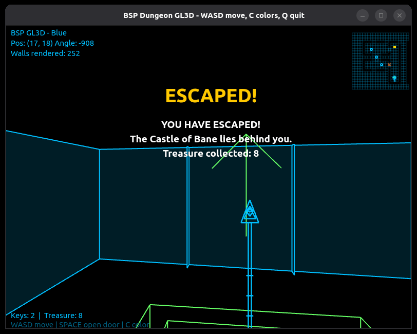

# Beneath the Castle of Bane

A first-person wireframe dungeon crawler in the style of Wolfenstein 3D, rendered with classic vector graphics aesthetics.

## Vision

**The Pitch:** You are a wizard trapped in the dungeons beneath the Castle of Bane. Armed with your staff, you must fight through monsters, find keys, unlock doors, and escape to the surface.

**The Feel:** 
- Wolfenstein 3D meets Battlezone
- Retro vector graphics (amber/green phosphor CRT look)
- Staff/wand always visible at bottom of screen (like Wolf3D's gun)
- Grid-based dungeon with doors, keys, enemies
- Simple but satisfying exploration and puzzle-solving

**Inspirations:**
- Wolfenstein 3D (1992) - First-person shooter on a grid, weapon always visible
- Battlezone (1980) - Vector graphics aesthetic
- Ultima Underworld (1992) - Dungeon crawling atmosphere
- Eye of the Beholder (1991) - D&D dungeon feel

---


## Current State (v0.5.0)

**Working:**
- Full OpenGL 3D rendering with hardware depth buffer
- BSP tree for efficient front-to-back wall traversal
- **Data-driven level loading** from `.level` files
- **Wizard's staff** with idle sway and walking bob
- **Entity rendering** - Wireframe keys, skeletons, ghosts, treasure, stairs, doors in world
- **Billboarded entities** - All entities face the camera (classic Doom style)
- **Doors** - Space to open, with visual door frame rendering
- **Locked doors** - Red X pattern, require gold key to open
- **Keys** - Walk over to collect, persist across levels
- **Treasure** - Collectible gold chests with running total
- **Stairs** - Walk onto to transition between levels
- **Level transitions** - Three-level campaign with escape win state
- **Inventory HUD** - Keys, treasure count displayed
- **Flash messages** - Centered text with fade-out for pickups, doors, level names
- **Minimap** - Color-coded entity markers (gold keys, red locked doors, green stairs)
- Player movement with collision buffer
- Doors block movement until opened
- Multiple color schemes (Amber, Green, Blue, White)
- 60fps on discrete GPU

---

## Roadmap

### Phase 1: Core Dungeon ✔
- [x] 3D wireframe rendering
- [x] BSP tree for wall ordering
- [x] Hardware depth buffer occlusion
- [x] Grid-based level structure
- [x] Player movement/collision with buffer
- [x] Minimap
- [x] Color schemes

### Phase 2: Interactivity ✔
- [x] **Weapon view** - Staff/wand at bottom of screen
- [x] **Weapon bob** - Subtle sway while walking/idle
- [x] **Data-driven levels** - Load from `.level` files
- [x] **Entity parsing** - Keys, enemies, doors, stairs
- [x] **Entity rendering** - Wireframe models billboarded toward camera
- [x] **Doors** - Space to open, visual door frames, blocks movement when closed
- [x] **Locked doors** - Require gold key, red X visual, consume key on unlock
- [x] **Keys** - Walk-over pickup, gold/silver types, persist across levels
- [x] **Treasure** - Collectible chests with running score
- [x] **Stairs** - Level transitions (down = next level, up = escape/prev)
- [x] **Level flow** - Three-level campaign with win state
- [x] **Inventory HUD** - Keys, treasure, flash messages

### Phase 3: Combat
- [ ] **Enemies** - Simple wandering monsters
- [ ] **Spellcasting** - Fire projectile from staff
- [ ] **Enemy AI** - Chase player when spotted
- [ ] **Health system** - Player and enemy HP
- [ ] **Death/respawn** - Game over state

### Phase 4: Polish
- [ ] **Sound effects** - Footsteps, doors, combat
- [ ] **Procedural dungeons** - Random level generation
- [ ] **Title screen** - Start menu
- [ ] **Score/treasure** - End-of-game summary

---

## Level Format

Levels are ASCII text files with a simple format:

```
name: The Dungeon Entrance
next: level2.level
prev: level0.level
---
####################
#@.......#....K....#
#........D.........#
#........#....E....#
####################
```

**Legend:**
| Char | Description |
|------|-------------|
| `#` | Solid wall |
| `.` | Floor |
| `@` | Player start |
| `D` | Door |
| `L` | Locked door |
| `K` | Key (gold) |
| `k` | Key (silver) |
| `E` | Skeleton enemy |
| `G` | Ghost enemy |
| `T` | Treasure |
| `<` | Stairs up |
| `>` | Stairs down |
| `S` | Secret door |
| `~` | Pit |

---

## The Campaign

### Level 1: The Dungeon Entrance
- 1 gold key, 2 doors, 1 treasure chest
- Stairs down to Level 2
- Tutorial-paced: open doors, find the key, collect treasure, descend

### Level 2: The Skeleton Halls
- 2 gold keys, 1 locked door, 2 regular doors
- 2 skeletons, 1 treasure chest
- Keys accumulate across levels — plan ahead

### Level 3: The Ghost Chamber
- 1 gold key, 1 locked door, 3 regular doors
- 3 ghosts guarding the treasure vault (7 chests)
- Stairs up = ESCAPE — you win!

---

## Project Structure

```
castle_of_bane/
├── bsp_dungeon_gl3d.py          # Main game (~1050 lines)
├── levels/
│   ├── level1.level             # The Dungeon Entrance
│   ├── level2.level             # The Skeleton Halls
│   └── level3.level             # The Ghost Chamber
├── wireframe_engine/
│   ├── __init__.py              # Package exports
│   ├── bsp.py                   # BSP tree
│   ├── dungeon.py               # Grid/wall system
│   └── level.py                 # Level loader
├── README.md
├── README_Engine.md
└── README_Roadmap.md
```

---

## Controls

| Key | Action |
|-----|--------|
| W / ↑ | Move forward |
| S / ↓ | Move backward |
| A / ← | Turn left |
| D / → | Turn right |
| Space | Open door / Unlock door (uses key) |
| C | Cycle color scheme |
| Q / Esc | Quit |

---

## Color Schemes

| Name | Hex | Vibe |
|------|-----|------|
| **Amber** | #FFB000 | Classic terminal (default) |
| Green | #00FFAA | Battlezone |
| Blue | #00BFFF | Sci-fi terminal |
| White | #FFFFFF | Monochrome |

---

## Running

```bash
# Install dependencies
pip install PyQt6 PyOpenGL

# Run (auto-loads levels/level1.level)
python bsp_dungeon_gl3d.py

# Run specific level
python bsp_dungeon_gl3d.py levels/level2.level

# On Linux with Nvidia GPU (recommended)
__NV_PRIME_RENDER_OFFLOAD=1 __GLX_VENDOR_LIBRARY_NAME=nvidia python bsp_dungeon_gl3d.py
```

---

## Development History

- **v0.1.0** - Basic painter's algorithm, flickering occlusion issues
- **v0.2.0** - Portal rendering, view-dependent culling, color schemes
- **v0.3.0** - Full OpenGL 3D with BSP tree, hardware depth buffer
- **v0.4.0** - Data-driven levels, wizard's staff with weapon bob, entity parsing
- **v0.5.0** - Entity rendering, doors/keys/locked doors, treasure, level transitions, inventory HUD, three-level campaign with escape win state

---

## License

Educational/personal project.

Wolfenstein 3D is © id Software.
Battlezone is © Atari.